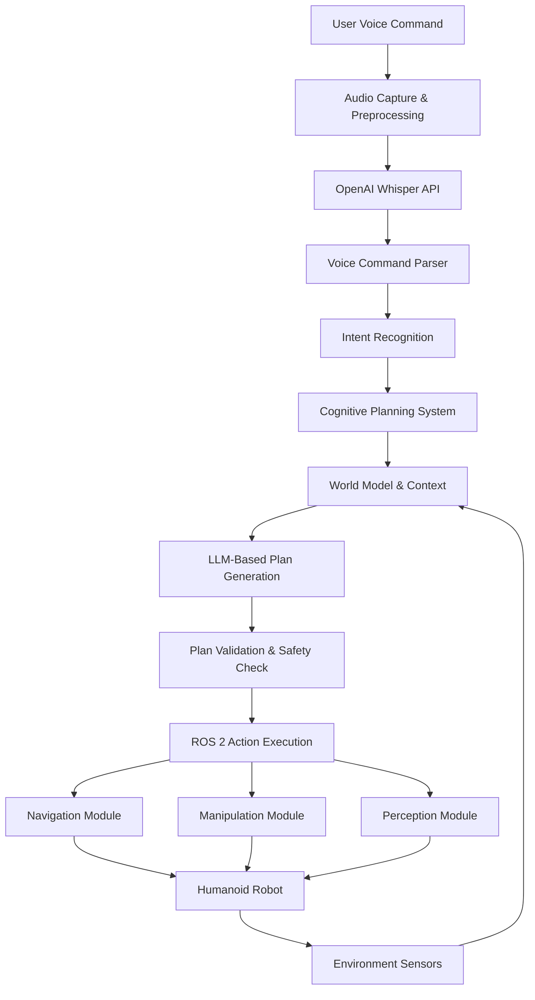

# Chapter 3: Capstone Project - The Autonomous Humanoid

## Introduction

In this capstone project, we'll integrate all the components we've learned about in the previous chapters to create a complete Vision-Language-Action (VLA) system for an autonomous humanoid robot. This project demonstrates how voice-to-action processing and cognitive planning work together to enable natural human-robot interaction.

The autonomous humanoid will be capable of receiving voice commands, understanding them through cognitive planning, and executing complex tasks in its environment. This integration showcases the full potential of VLA systems and provides a practical example of how these technologies can be deployed in real-world applications.

## System Architecture Overview

The complete VLA system for our autonomous humanoid consists of several interconnected components:



### Key Components Integration

1. **Voice Processing Pipeline**: Handles speech-to-text conversion and command parsing
2. **Cognitive Planning Engine**: Translates natural language into action plans
3. **World Model**: Maintains environmental context and robot state
4. **ROS 2 Interface**: Executes planned actions using robot capabilities
5. **Safety System**: Validates all actions for safety before execution

## Implementation Architecture

### Main VLA System Node

The central component that orchestrates all VLA functionality:

```python
import rclpy
from rclpy.node import Node
from rclpy.action import ActionClient
from std_msgs.msg import String
from sensor_msgs.msg import Image, CompressedImage
from geometry_msgs.msg import Pose
from builtin_interfaces.msg import Duration
import asyncio
import openai
from typing import Dict, Any, List

class VLASystemNode(Node):
    def __init__(self):
        super().__init__('vla_system')

        # Initialize components
        self.voice_processor = VoiceToActionProcessor(
            api_key=self.get_parameter('openai_api_key').value
        )
        self.cognitive_planner = CognitivePlanner(self)
        self.world_model = WorldModelInterface(self)
        self.safety_validator = SafetyValidator(self)

        # Publishers and subscribers
        self.voice_command_pub = self.create_publisher(
            String, 'voice_commands', 10
        )
        self.system_status_pub = self.create_publisher(
            String, 'system_status', 10
        )

        # Subscribe to audio input
        self.audio_sub = self.create_subscription(
            CompressedImage,  # Audio could be transmitted as compressed data
            'audio_input',
            self.audio_callback,
            10
        )

        # Timer for periodic world model updates
        self.update_timer = self.create_timer(1.0, self.update_world_model)

    def audio_callback(self, msg: CompressedImage):
        """
        Process incoming audio data and generate robot actions
        """
        try:
            # Convert audio data and process
            audio_bytes = self.convert_audio_msg_to_bytes(msg)

            # Transcribe audio using Whisper
            transcript = asyncio.run(
                self.voice_processor.transcribe_audio(audio_bytes)
            )

            if transcript:
                self.get_logger().info(f"Recognized: {transcript}")

                # Process the voice command
                self.process_voice_command(transcript)

        except Exception as e:
            self.get_logger().error(f"Error processing audio: {e}")

    def process_voice_command(self, transcript: str):
        """
        Complete pipeline: NLU -> Planning -> Execution
        """
        try:
            # Update world model before processing
            self.world_model.update()

            # Get current state for planning
            world_state = self.world_model.get_current_state()
            robot_caps = self.world_model.get_robot_capabilities()

            # Generate action plan using cognitive planning
            action_plan = self.cognitive_planner.generate_plan(
                transcript, world_state, robot_caps
            )

            # Validate plan for safety
            is_safe, issues = self.safety_validator.validate_plan(
                action_plan, world_state
            )

            if not is_safe:
                self.get_logger().error(f"Plan rejected for safety: {issues}")
                return

            # Execute the validated plan
            self.execute_plan(action_plan)

        except Exception as e:
            self.get_logger().error(f"Error processing voice command: {e}")

    def execute_plan(self, action_plan: List[Dict]):
        """
        Execute the planned sequence of actions
        """
        for i, action in enumerate(action_plan):
            self.get_logger().info(f"Executing action {i+1}/{len(action_plan)}: {action}")

            success = self.execute_single_action(action)
            if not success:
                self.get_logger().error(f"Action failed: {action}")
                break  # Stop execution on failure

    def execute_single_action(self, action: Dict) -> bool:
        """
        Execute a single action based on its type
        """
        action_type = action.get('action_type', 'unknown')

        if action_type == 'navigation':
            return self.execute_navigation_action(action)
        elif action_type == 'manipulation':
            return self.execute_manipulation_action(action)
        elif action_type == 'perception':
            return self.execute_perception_action(action)
        else:
            self.get_logger().warn(f"Unknown action type: {action_type}")
            return False
```

### Voice Processing Component

Handles the complete voice-to-action pipeline:

```python
import asyncio
import openai
from io import BytesIO
import re
import json

class VoiceToActionProcessor:
    def __init__(self, api_key: str):
        openai.api_key = api_key

    async def transcribe_audio(self, audio_bytes: BytesIO) -> str:
        """
        Transcribe audio using OpenAI Whisper API
        """
        try:
            transcription = await openai.Audio.atranscribe(
                "whisper-1",
                audio_bytes,
                response_format="text"
            )
            return transcription.strip()
        except Exception as e:
            print(f"Error transcribing audio: {e}")
            return ""

    def parse_voice_command(self, transcript: str) -> Dict:
        """
        Parse voice command and extract intent and entities
        """
        # Define command patterns
        command_patterns = {
            'move_to': [
                r'move to (.+)',
                r'go to (.+)',
                r'navigate to (.+)',
                r'walk to (.+)'
            ],
            'pick_up': [
                r'pick up (.+)',
                r'grasp (.+)',
                r'get (.+)',
                r'fetch (.+)'
            ],
            'place': [
                r'place (.+) at (.+)',
                r'put (.+) on (.+)',
                r'drop (.+) at (.+)'
            ],
            'follow': [
                r'follow me',
                r'come with me',
                r'follow (.+)'
            ],
            'find': [
                r'find (.+)',
                r'locate (.+)',
                r'where is (.+)'
            ]
        }

        # Parse the transcript for command patterns
        for intent, patterns in command_patterns.items():
            for pattern in patterns:
                match = re.search(pattern, transcript, re.IGNORECASE)
                if match:
                    return {
                        'intent': intent,
                        'entities': match.groups(),
                        'original_command': transcript
                    }

        # If no specific pattern matches, return as general command
        return {
            'intent': 'general',
            'entities': [transcript],
            'original_command': transcript
        }
```

### Cognitive Planning Component

Integrates LLM-based planning with ROS 2 execution:

```python
import json
import re
from typing import Dict, Any, List

class CognitivePlanner:
    def __init__(self, node):
        self.node = node

    def generate_plan(self,
                     user_instruction: str,
                     world_state: Dict,
                     robot_caps: Dict) -> List[Dict]:
        """
        Generate action plan using LLM-based cognitive planning
        """
        prompt = self.create_planning_prompt(user_instruction, world_state, robot_caps)

        # Call LLM API (implementation depends on your LLM provider)
        llm_response = self.call_llm_api(prompt)

        # Process and return the action plan
        return self.process_llm_plan(llm_response)

    def create_planning_prompt(self,
                              user_instruction: str,
                              world_state: Dict,
                              robot_caps: Dict) -> str:
        """
        Create a comprehensive prompt for cognitive planning
        """
        return f"""
        You are an autonomous humanoid robot cognitive planning system.

        USER INSTRUCTION: {user_instruction}

        ROBOT CAPABILITIES:
        - Mobility: {robot_caps.get('mobility', 'Unknown')}
        - Manipulation: {robot_caps.get('manipulation', 'Unknown')}
        - Sensors: {robot_caps.get('sensors', 'Unknown')}
        - Communication: {robot_caps.get('communication', 'Unknown')}

        CURRENT WORLD STATE:
        - Known locations: {world_state.get('locations', [])}
        - Available objects: {world_state.get('objects', [])}
        - Current position: {world_state.get('current_position', 'Unknown')}
        - Robot battery level: {world_state.get('battery_level', 'Unknown')}%
        - Navigation map: {world_state.get('navigation_map', 'Unknown')}

        ENVIRONMENT CONSTRAINTS:
        - All actions must be safe for humans and environment
        - Robot must maintain communication with base station
        - Avoid areas marked as restricted or unsafe

        Please generate a detailed sequence of actions to fulfill the user's request.
        Each action should be specific, executable, and safe.

        Format your response as a JSON list of actions with this structure:
        [
            {{
                "action_type": "navigation|manipulation|perception|communication",
                "target": "specific target or location",
                "parameters": {{"key": "value"}},
                "reasoning": "brief explanation of why this action is needed",
                "expected_duration": "estimated time in seconds"
            }}
        ]

        Prioritize safety and feasibility. Consider the robot's current state and environment.
        """

    def call_llm_api(self, prompt: str) -> str:
        """
        Call LLM API to generate action plan
        This is a placeholder - implement with your preferred LLM provider
        """
        # In a real implementation, you would call your LLM API here
        # For example: OpenAI, Anthropic, or local model
        pass

    def process_llm_plan(self, llm_response: str) -> List[Dict]:
        """
        Extract and validate action plan from LLM response
        """
        # Extract JSON from response (in case it's embedded in text)
        json_match = re.search(r'\[.*\]', llm_response, re.DOTALL)
        if not json_match:
            raise ValueError("No valid action plan found in LLM response")

        try:
            action_plan = json.loads(json_match.group())
            return self.validate_action_plan(action_plan)
        except json.JSONDecodeError as e:
            raise ValueError(f"Invalid JSON in action plan: {e}")

    def validate_action_plan(self, action_plan: List[Dict]) -> List[Dict]:
        """
        Validate the action plan structure
        """
        validated_plan = []

        for i, action in enumerate(action_plan):
            # Validate required fields
            required_fields = ['action_type', 'target', 'reasoning']
            for field in required_fields:
                if field not in action:
                    raise ValueError(f"Action {i} missing required field: {field}")

            # Validate action type
            valid_action_types = ['navigation', 'manipulation', 'perception', 'communication']
            if action['action_type'] not in valid_action_types:
                raise ValueError(f"Action {i} has invalid action type: {action['action_type']}")

            validated_plan.append(action)

        return validated_plan
```

### Safety Validation System

Critical component for ensuring safe operation:

```python
from typing import Dict, Any, List, Tuple

class SafetyValidator:
    def __init__(self, node):
        self.node = node
        self.safety_constraints = self.load_safety_constraints()

    def load_safety_constraints(self) -> Dict:
        """
        Load safety constraints and rules
        """
        return {
            'navigation': {
                'min_distance_to_human': 0.5,  # meters
                'max_speed': 1.0,  # m/s
                'restricted_areas': [],
                'collision_threshold': 0.1  # meters
            },
            'manipulation': {
                'max_force': 50.0,  # Newtons
                'object_weight_limit': 5.0,  # kg
                'dangerous_objects': ['knife', 'scissors', 'sharp', 'hot']
            },
            'general': {
                'max_operation_time': 3600,  # seconds
                'min_battery_level': 10,  # percent
                'required_human_supervision': False
            }
        }

    def validate_plan(self, action_plan: List[Dict], world_state: Dict) -> Tuple[bool, List[str]]:
        """
        Validate action plan against safety constraints
        """
        issues = []

        for i, action in enumerate(action_plan):
            action_issues = self.validate_single_action(action, world_state)
            for issue in action_issues:
                issues.append(f"Action {i}: {issue}")

        return len(issues) == 0, issues

    def validate_single_action(self, action: Dict, world_state: Dict) -> List[str]:
        """
        Validate a single action against safety constraints
        """
        issues = []
        action_type = action.get('action_type', 'unknown')

        if action_type == 'navigation':
            issues.extend(self.validate_navigation_action(action, world_state))
        elif action_type == 'manipulation':
            issues.extend(self.validate_manipulation_action(action, world_state))
        elif action_type == 'perception':
            issues.extend(self.validate_perception_action(action, world_state))

        return issues

    def validate_navigation_action(self, action: Dict, world_state: Dict) -> List[str]:
        """
        Validate navigation action for safety
        """
        issues = []

        # Check if target location is safe
        target_location = action.get('target', '')
        if target_location in self.safety_constraints['navigation']['restricted_areas']:
            issues.append(f"Target location '{target_location}' is restricted")

        # Additional navigation safety checks would go here
        return issues

    def validate_manipulation_action(self, action: Dict, world_state: Dict) -> List[str]:
        """
        Validate manipulation action for safety
        """
        issues = []

        # Check if target object is safe to manipulate
        target_object = action.get('target', '').lower()
        dangerous_objects = self.safety_constraints['manipulation']['dangerous_objects']

        if any(dangerous in target_object for dangerous in dangerous_objects):
            issues.append(f"Object '{target_object}' may be dangerous to manipulate")

        # Additional manipulation safety checks would go here
        return issues

    def validate_perception_action(self, action: Dict, world_state: Dict) -> List[str]:
        """
        Validate perception action for safety
        """
        issues = []

        # Perception actions are generally safe, but could add constraints here
        return issues
```

## Real-time Processing and Error Handling

### Adaptive Execution Framework

The system must handle unexpected situations and adapt its plans:

```python
class AdaptiveExecutionFramework:
    def __init__(self, vla_node: VLASystemNode):
        self.vla_node = vla_node
        self.execution_context = {}
        self.recovery_strategies = self.load_recovery_strategies()

    def load_recovery_strategies(self) -> Dict:
        """
        Load predefined recovery strategies for common failure scenarios
        """
        return {
            'navigation_failure': [
                'try_alternative_path',
                'request_human_assistance',
                'return_to_safe_location'
            ],
            'manipulation_failure': [
                'reposition_robot',
                'retry_with_different_approach',
                'request_human_assistance'
            ],
            'object_not_found': [
                'expand_search_area',
                'ask_user_for_clarification',
                'use_alternative_object'
            ]
        }

    def execute_with_adaptation(self, action_plan: List[Dict]) -> bool:
        """
        Execute plan with adaptive capabilities
        """
        for i, action in enumerate(action_plan):
            success = self.execute_action_with_monitoring(action)

            if not success:
                # Handle failure with appropriate recovery strategy
                recovery_success = self.handle_execution_failure(action, i, action_plan)
                if not recovery_success:
                    return False

        return True

    def execute_action_with_monitoring(self, action: Dict) -> bool:
        """
        Execute action with real-time monitoring
        """
        try:
            # Start action execution
            execution_result = self.vla_node.execute_single_action(action)

            # Monitor execution for success/failure
            if execution_result:
                return True
            else:
                return False

        except Exception as e:
            self.vla_node.get_logger().error(f"Action execution error: {e}")
            return False

    def handle_execution_failure(self, failed_action: Dict,
                               action_index: int,
                               full_plan: List[Dict]) -> bool:
        """
        Handle execution failure with recovery strategies
        """
        action_type = failed_action.get('action_type', 'unknown')
        failure_type = f"{action_type}_failure"

        if failure_type in self.recovery_strategies:
            strategies = self.recovery_strategies[failure_type]

            for strategy in strategies:
                if self.attempt_recovery(strategy, failed_action):
                    return True

        self.vla_node.get_logger().error(f"Failed to recover from action failure: {failed_action}")
        return False

    def attempt_recovery(self, strategy: str, failed_action: Dict) -> bool:
        """
        Attempt a specific recovery strategy
        """
        if strategy == 'try_alternative_path':
            return self.try_alternative_navigation_path(failed_action)
        elif strategy == 'request_human_assistance':
            return self.request_human_assistance(failed_action)
        elif strategy == 'return_to_safe_location':
            return self.return_to_safe_location()
        # Add more strategies as needed

        return False
```

## Complete System Integration Example

Here's how all components come together in the main system:

```python
def main(args=None):
    rclpy.init(args=args)

    # Create the VLA system node
    vla_node = VLASystemNode()

    # Set OpenAI API key as parameter
    vla_node.declare_parameter('openai_api_key', '')

    # Create adaptive execution framework
    adaptive_framework = AdaptiveExecutionFramework(vla_node)

    try:
        # Spin the node to process callbacks
        rclpy.spin(vla_node)
    except KeyboardInterrupt:
        pass
    finally:
        vla_node.destroy_node()
        rclpy.shutdown()

if __name__ == '__main__':
    main()
```

## Testing and Validation

### Unit Testing for Core Components

```python
import unittest
from unittest.mock import Mock, patch
import asyncio

class TestVLASystem(unittest.TestCase):
    def setUp(self):
        self.mock_node = Mock()
        self.voice_processor = VoiceToActionProcessor("test-key")
        self.cognitive_planner = CognitivePlanner(self.mock_node)

    def test_voice_command_parsing(self):
        """Test voice command parsing functionality"""
        transcript = "go to the kitchen"
        result = self.voice_processor.parse_voice_command(transcript)

        self.assertEqual(result['intent'], 'move_to')
        self.assertEqual(result['entities'], ('the kitchen',))

    def test_simple_navigation_plan(self):
        """Test simple navigation plan generation"""
        with patch.object(self.cognitive_planner, 'call_llm_api') as mock_api:
            mock_api.return_value = '[{"action_type": "navigation", "target": "kitchen", "reasoning": "User requested to go to kitchen"}]'

            world_state = {'locations': ['kitchen', 'living room']}
            robot_caps = {'mobility': 'wheeled base'}

            plan = self.cognitive_planner.generate_plan(
                "go to the kitchen", world_state, robot_caps
            )

            self.assertEqual(len(plan), 1)
            self.assertEqual(plan[0]['action_type'], 'navigation')
            self.assertEqual(plan[0]['target'], 'kitchen')

if __name__ == '__main__':
    unittest.main()
```

### Integration Testing

```python
def test_complete_vla_pipeline():
    """
    Integration test for the complete VLA pipeline
    """
    # This would test the complete flow:
    # 1. Voice input
    # 2. Speech recognition
    # 3. Cognitive planning
    # 4. Action execution
    # 5. Safety validation

    # Implementation would depend on your testing framework and available test infrastructure
    pass
```

## Performance Optimization

### Caching and Efficiency

```python
import functools
import time
from typing import Any

class OptimizedVLASystem(VLASystemNode):
    def __init__(self):
        super().__init__()
        self.response_cache = {}
        self.cache_ttl = 300  # 5 minutes

    @functools.lru_cache(maxsize=128)
    def get_cached_plan(self, instruction: str, world_state_hash: str):
        """
        Cache frequently requested plans to improve response time
        """
        # Implementation would call the cognitive planner
        pass

    def should_cache_plan(self, action_plan: List[Dict]) -> bool:
        """
        Determine if a plan should be cached based on its characteristics
        """
        # Don't cache plans that involve dynamic elements
        dynamic_indicators = ['person', 'moving', 'current']
        plan_text = ' '.join(str(action) for action in action_plan).lower()

        return not any(indicator in plan_text for indicator in dynamic_indicators)
```

## Best Practices for VLA System Development

### 1. Modularity and Extensibility
Design components to be modular and easily extensible for new capabilities.

### 2. Safety-First Design
Implement comprehensive safety validation at every level of the system.

### 3. Human-Robot Interaction
Design for clear communication and feedback between the robot and human users.

### 4. Robust Error Handling
Implement comprehensive error handling and recovery mechanisms.

### 5. Performance Monitoring
Include monitoring capabilities to track system performance and identify bottlenecks.

## Summary

This capstone project demonstrates the complete integration of Vision-Language-Action components into an autonomous humanoid robot system. Key takeaways include:

1. **System Architecture**: How all VLA components work together in a unified system
2. **Safety Integration**: Critical safety validation at every step of the process
3. **Real-time Processing**: Techniques for handling real-time voice commands and execution
4. **Adaptive Execution**: Framework for handling failures and unexpected situations
5. **Performance Optimization**: Strategies for efficient system operation

The complete VLA system enables natural human-robot interaction through voice commands while maintaining safety and reliability. This foundation can be extended to support additional capabilities and use cases in various robotic applications.